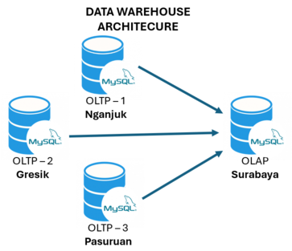
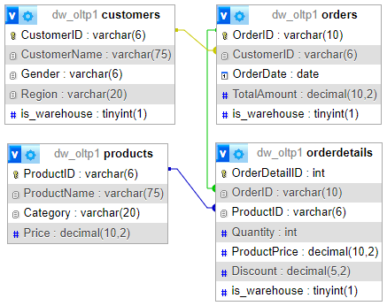
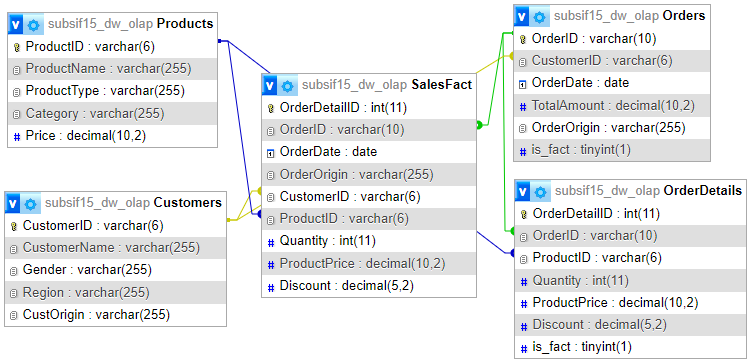

# Data Warehousing Application

This project aims to develop a data warehousing application using Visual Studio 2019 and C#.NET. to extract, transform, and load (ETL) data from operational systems into a star schema data warehouse built on MySQL. The application will also perform basic analysis on the data to provide insights into customer behavior and sales trends. This application is designed to provide students with an overview of the ETL (Extract, Transform, Load) process in data warehousing.

**Key Metrics for Analysis:**
1. Daily/Weekly/Monthly Sales: Provides information on total sales over various time periods, helping CEOtrack sales performance over time.
2. Average Order Value: Shows the average value of orders placed by customers, aiding in planning promotions or special offer packages.
3. Customer Purchase Frequency: Provides insights into how often customers return to order, helping identify loyal customers and develop loyalty programs.
4. Best-Selling Products Analysis: Identifies the most frequently sold products, enabling CEO make better stock and promotional decisions.
5. Best-City for Selling Performances: Provides information on which City (OLTP) sold the highest amount, helping CEO to promote city's manager.

## Preparation

Do this step before you RUN the application.

### Import SQL to OLTP

1. Open MySQL on your Local Computer. You can use MySQL Workbench.
2. Import SQL. You can choose only 1 OLTP, depends on your OLTP area.
   - [oltp-1.sql](DW_ETL_Example/Resources/SQL/oltp-1.sql)
   - [oltp-2.sql](DW_ETL_Example/Resources/SQL/oltp-2.sql)
   - [oltp-3.sql](DW_ETL_Example/Resources/SQL/oltp-3.sql)
3. Check if the database already created and data already imported.
   - Products = 20 data
   - Customers = 20 data
   - Orders = 20 data
   - OrderDetails = 50 data

### Import SQL to OLAP

1. Open MySQL on your Cloud Server. 
2. Import SQL for the DB. [olap.sql](DW_ETL_Example/Resources/SQL/olap.sql)
4. Import SQL for Analysis the Metrics. We will use `VIEW` and `STORED PROCEDURE`. [transform-analysis.sql](DW_ETL_Example/Resources/SQL/transform-analysis.sql)
5. Check if the database already created and data already imported.
   - Products = 20 data
   - Customers = *NO data*
   - Orders = *NO data*
   - OrderDetails = *NO data*
   - SalesFact = *NO data*
   - View = `vSales`, `vSoldProducts`
   - Procedure = `pSalesFilter`, `pSoldProductsFilter`

## RUN the application

### Extract and Load
1. Click on `Extract Load` button, then you will redirect to FormExtract form.
2. Choose OLTP source, enter your DB username and password, then click on `CONNECT` button.
3. Choose OLAP host for load the extracted data. Enter the host name, DB name, DB username and password. Click on `CONNECT` button to connect to the host.
4. After status OLTP is connected and status OLAP is connected, now you can choose `Table Name` that you want to extract the data. Click on `EXTRACT` button to start the process.
5. Extracted data will appear in the data-grid-view, and to load the data to OLAP click on `LOAD TO DW / OLAP` button.
6. The load process is finished.

### Transform
Transform process occur in the Data Warehouse. It will create the Fact Table.
1. Click on `Transform` button, then you will redirect to FormTransform form.
2. Connect OLAP host for transforming the data. Enter the host name, DB name, DB username and password. Click on `CONNECT` button to connect to the host.
3. After status OLAP is connected, now you can start transform the data by click on `TRANSFORM` button.
4. The transform process is finished.

### Analysis
Analysis is use CEO for analysis the business. It only created for Metics 3 and 4.
1. Click on `Analysis` button, then you will redirect to FormAnalysis form.
2. Connect OLAP host for transforming the data. Enter the host name, DB name, DB username and password. Click on `CONNECT` button to connect to the host.
3. After status OLAP is connected, choose the metrics that you want. For viewing the report, click on `Get Report` button.
4. The result will show in data-grid-view. *For chart only available for Metric 3 and 4*

## Built With

  - Visual Studio 2019
  - MySQL Server
  - MySQL Workbench

## Authors

  - **Indra Maryati** -
    [Email](mailto:indra.maryati@ciputra.ac.id)

## Acknowledgments

  - Course: ISB02303401 - Data Warehousing
  - Information System for Business (ISB) Dept., Faculty of Information Technology, Universitas Ciputra Surabaya
    
